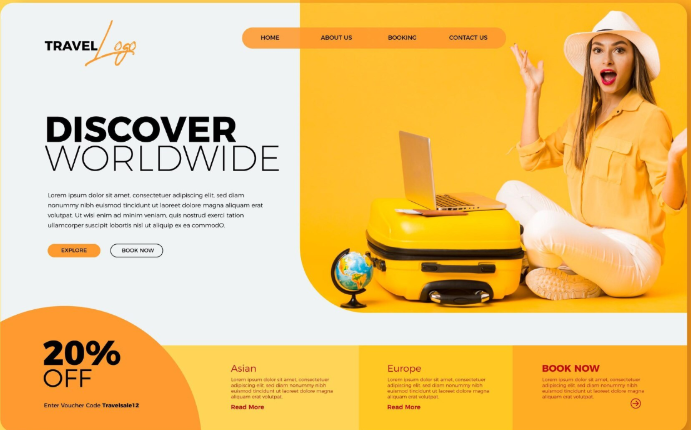

# Travel Sale - Next.js Project



This is a modern travel-themed web application built with [Next.js](https://nextjs.org). The project is based on a mockup design from Freepik, which has been translated into code and enhanced with animations, responsiveness, and additional features.

## Features

- **Interactive Animations**: Smooth animations powered by [Framer Motion](https://www.framer.com/motion/).
- **Responsive Design**: Fully responsive layout for mobile, tablet, and desktop devices.
- **Modern UI**: Clean and visually appealing design with gradient backgrounds and dynamic elements.
- **Optimized Performance**: Leveraging Next.js features like image optimization and server-side rendering.
- **Custom Enhancements**: Improved upon the original mockup with additional sections and interactivity.

## Preview


## Getting Started

To run the project locally, follow these steps:

1. Clone the repository:
   ```bash
   git clone https://github.com/your-username/travel-sale.git
   cd travel-sale
   ```

2. Install dependencies:
   ```bash
   npm install
   # or
   yarn install
   ```

3. Start the development server:
   ```bash
   npm run dev
   # or
   yarn dev
   ```

4. Open [http://localhost:3000](http://localhost:3000) in your browser to view the app.

## Project Structure

- **`app/`**: Contains the main application files, including `page.tsx` for the homepage and `layout.tsx` for the layout.
- **`public/`**: Stores static assets like images (`mockup.png`, `code.png`, etc.).
- **`styles/`**: Global CSS styles for the project.

## Technologies Used

- [Next.js](https://nextjs.org) - React framework for server-side rendering and static site generation.
- [Framer Motion](https://www.framer.com/motion/) - For animations and transitions.
- [Tailwind CSS](https://tailwindcss.com) - Utility-first CSS framework for styling.
- [Freepik](https://www.freepik.com) - Source of the original mockup design.

## Deployment

This project can be easily deployed on [Vercel](https://vercel.com), the creators of Next.js. Follow these steps:

1. Push your code to a GitHub repository.
2. Connect your repository to Vercel.
3. Deploy your app with a single click.

For more details, check out the [Next.js deployment documentation](https://nextjs.org/docs/app/building-your-application/deploying).

## Credits

- Mockup design by [Freepik](https://www.freepik.com).
- Developed and enhanced by Zakaria.

## License

This project is licensed under the MIT License. Feel free to use and modify it as needed.